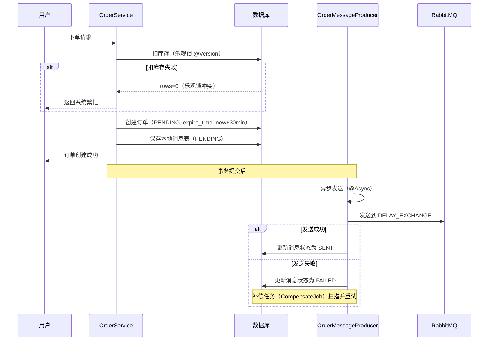
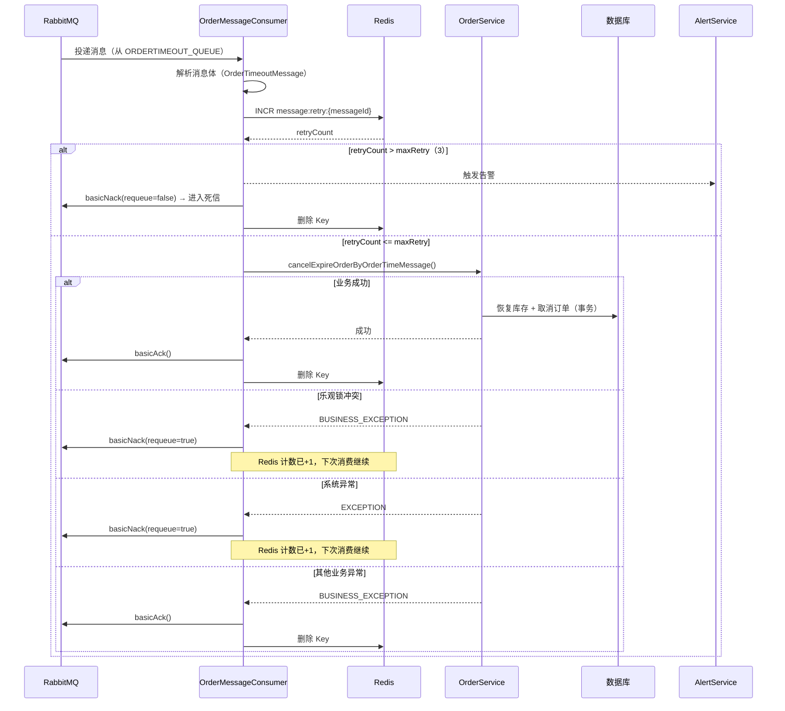
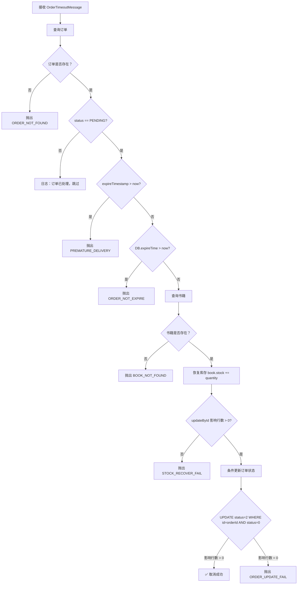

# 订单超时重试功能 - 核心设计文档

> 本文档描述商城项目中订单超时自动取消功能的完整架构设计与核心实现。
> 代码已上传 GitHub：https://github.com/leij56789/mall-backend.git

---

## 📋 目录

- [一、功能概述](#一功能概述)
- [二、整体架构图](#二整体架构图)
- [三、核心流程说明](#三核心流程说明)
- [四、技术方案选型](#四技术方案选型)
- [五、数据表设计](#五数据表设计)
- [六、核心代码实现](#六核心代码实现)
- [七、RabbitMQ 队列配置](#七rabbitmq-队列配置)
- [八、关键设计原则](#八关键设计原则)
- [九、异常场景处理](#九异常场景处理)
- [十、监控与告警](#十监控与告警)
- [十一、面试常见问题](#十一面试常见问题)

---

## 一、功能概述

### 1.1 业务背景

用户下单后，订单进入"待支付"状态，超时时间默认为 **30 分钟**。若用户在 30 分钟内未完成支付，系统需自动取消订单并恢复库存。

### 1.2 核心目标

| 目标 | 说明 |
|:---|:---|
| **自动取消** | 订单超时后自动将状态从 PENDING 变为 CANCELLED |
| **库存恢复** | 取消订单时自动恢复书籍库存 |
| **最终一致性** | 保证消息不丢失，即使 MQ 或 Redis 故障 |
| **高可用** | 支持集群部署，Redis 故障时本地降级 |

### 1.3 技术栈

| 组件 | 版本/方案 | 用途 |
|:---|:---|:---|
| Spring Boot | 3.x / 4.x | 应用框架 |
| MyBatis-Plus | 最新 | ORM + 乐观锁 |
| RabbitMQ | 4.3.x | 消息队列 |
| Redis | 6.x / 7.x | 重试计数 + 分布式锁 |
| MySQL | 8.x | 数据持久化 |
| Jackson | 2.x | JSON 序列化 |

---

## 二、整体架构图

```

┌─────────────────────────────────────────────────────────────────────────────────────┐
│                              订单超时重试 - 完整架构                               │
├─────────────────────────────────────────────────────────────────────────────────────┤
│                                                                                     │
│  ┌─────────────────────────────────────────────────────────────────────────────┐   │
│  │                         1. 订单创建阶段                                     │   │
│  │                                                                             │   │
│  │  用户下单 ──→ 扣库存(乐观锁 @Version) ──→ 创建订单(PENDING)                │   │
│  │                              │              │                               │   │
│  │                              ▼              ▼                               │   │
│  │                         库存扣减成功    ──→ 发送延迟消息                     │   │
│  │                                          (TTL=30分钟)                      │   │
│  │                                          ↓                                  │   │
│  │                              保存本地消息表 (PENDING)                       │   │
│  └─────────────────────────────────────────────────────────────────────────────┘   │
│                                          │                                          │
│                                          ▼                                          │
│  ┌─────────────────────────────────────────────────────────────────────────────┐   │
│  │                         2. 延迟队列等待 (RabbitMQ)                          │   │
│  │                                                                             │   │
│  │  ┌─────────────────────────────────────────────────────────────────────┐   │   │
│  │  │  DELAY_QUEUE (delay.queue)                                         │   │   │
│  │  │  - x-message-ttl: 30分钟                                           │   │   │
│  │  │  - x-dead-letter-exchange: orderTimeout.exchange                   │   │   │
│  │  │  - x-dead-letter-routing-key: orderTimeout.routing.key            │   │   │
│  │  └─────────────────────────────────────────────────────────────────────┘   │   │
│  └─────────────────────────────────────────────────────────────────────────────┘   │
│                                          │                                          │
│                                          ▼ (TTL 过期 → 死信转发)                   │
│  ┌─────────────────────────────────────────────────────────────────────────────┐   │
│  │                         3. 业务队列 (消费者监听)                            │   │
│  │                                                                             │   │
│  │  ┌─────────────────────────────────────────────────────────────────────┐   │   │
│  │  │  ORDERTIMEOUT_QUEUE (orderTimeout.queue)                           │   │   │
│  │  │  - x-max-delivery-count: 3 (服务端投递上限)                        │   │   │
│  │  │  - x-dead-letter-exchange: order.dlq.exchange                     │   │   │
│  │  │  - x-dead-letter-routing-key: ordertimeout.dlq.routing.key       │   │   │
│  │  └─────────────────────────────────────────────────────────────────────┘   │   │
│  └─────────────────────────────────────────────────────────────────────────────┘   │
│                                          │                                          │
│                                          ▼                                          │
│  ┌─────────────────────────────────────────────────────────────────────────────┐   │
│  │                         4. 消费者处理流程                                   │   │
│  │                                                                             │   │
│  │  ┌─────────────────────────────────────────────────────────────────────┐   │   │
│  │  │  OrderMessageConsumer.handleOrderTimeout()                          │   │   │
│  │  │                                                                     │   │   │
│  │  │  Step 1: 解析消息 → 获取 orderId, messageId                         │   │   │
│  │  │  Step 2: Redis 重试计数 (message:retry:{messageId})                 │   │   │
│  │  │          ↓                                                          │   │   │
│  │  │  Step 3: retryCount > maxRetry ?                                   │   │   │
│  │  │          ├── 是 → NACK(不重试) → 进入死信队列 + 告警               │   │   │
│  │  │          └── 否 → 执行业务取消                                      │   │   │
│  │  │                    ↓                                                │   │   │
│  │  │  Step 4: 业务结果                                                   │   │   │
│  │  │          ├── 成功 → ACK + 删除 Redis Key                           │   │   │
│  │  │          ├── 乐观锁冲突 → NACK(重试) + Redis 计数 +1              │   │   │
│  │  │          └── 系统异常 → NACK(重试) + Redis 计数 +1                │   │   │
│  │  └─────────────────────────────────────────────────────────────────────┘   │   │
│  └─────────────────────────────────────────────────────────────────────────────┘   │
│                                          │                                          │
│                     ┌────────────────────┼────────────────────┐                    │
│                     ▼                    ▼                    ▼                    │
│  ┌─────────────────────────────────────────────────────────────────────────────┐   │
│  │                         5. 三种最终结果                                     │   │
│  │                                                                             │   │
│  │  ┌──────────────────┐  ┌──────────────────┐  ┌──────────────────┐         │   │
│  │  │  ✅ 成功路径     │  │  🔄 重试路径     │  │  💀 死信路径     │         │   │
│  │  │                  │  │                  │  │                  │         │   │
│  │  │  订单 CANCELLED  │  │  Redis 计数+1    │  │  retryCount>3    │         │   │
│  │  │  库存已恢复      │  │  NACK(重试)     │  │  进入 DLQ        │         │   │
│  │  │  Redis Key 删除  │  │  等待下次消费    │  │  告警触发        │         │   │
│  │  │  消息 ACK        │  │                  │  │  人工介入        │         │   │
│  │  └──────────────────┘  └──────────────────┘  └──────────────────┘         │   │
│  └─────────────────────────────────────────────────────────────────────────────┘   │
│                                                                                     │
└─────────────────────────────────────────────────────────────────────────────────────┘

```

---

## 三、核心流程说明

### 3.1 消息发送流程（生产者）



3.2 消息消费流程（消费者）



3.3 超时取消业务逻辑



---

四、技术方案选型

4.1 为什么用 RabbitMQ 而不是定时任务？

方案 实时性 可靠性 数据库压力 扩展性
定时任务扫表 差（分钟级） 高 高（频繁扫描） 差
Redis ZSet 好（秒级） 中 低 好
RabbitMQ 延迟队列 好（秒级） 高 低 好

4.2 为什么用 TTL+死信 而不是延迟插件？

· 原因：RabbitMQ 4.3.x 官方停止维护 rabbitmq_delayed_message_exchange 插件
· 方案：TTL + 死信队列是官方推荐的替代方案
· 优势：无需安装插件，原生支持，高可用

4.3 为什么用 Redis 维护重试次数？

方案 优点 缺点
消息头 x-retry-count 无外部依赖 basicNack(requeue=true) 不更新头信息
服务端 x-delivery-count 由 MQ 维护 死信转发场景下不可用
Redis INCR 原子操作，支持集群，性能高 依赖 Redis 可用性

4.4 为什么用乐观锁扣库存？

· 冲突概率低（超时取消场景），适合乐观锁
· 无需锁行，性能高
· MyBatis-Plus @Version 自动处理，代码简洁

---

五、数据表设计

5.1 订单表 (orders)

```sql
CREATE TABLE `orders` (
    `id` BIGINT PRIMARY KEY AUTO_INCREMENT,
    `order_no` VARCHAR(32) NOT NULL UNIQUE COMMENT '订单号（雪花算法）',
    `user_id` BIGINT NOT NULL COMMENT '用户ID',
    `book_id` BIGINT NOT NULL COMMENT '书籍ID',
    `quantity` INT NOT NULL COMMENT '数量',
    `total_amount` DECIMAL(10,2) NOT NULL COMMENT '总金额',
    `status` TINYINT DEFAULT 0 COMMENT '0待支付 1已支付 2已取消 3已完成',
    `address` VARCHAR(200) COMMENT '收货地址',
    `expire_time` DATETIME COMMENT '超时时间（创建时+30分钟）',
    `created_at` DATETIME DEFAULT CURRENT_TIMESTAMP,
    `updated_at` DATETIME DEFAULT CURRENT_TIMESTAMP ON UPDATE CURRENT_TIMESTAMP,
    INDEX `idx_user_id` (`user_id`),
    INDEX `idx_order_no` (`order_no`),
    INDEX `idx_status` (`status`)
);
```

5.2 书籍表 (book)

```sql
CREATE TABLE `book` (
    `id` BIGINT PRIMARY KEY AUTO_INCREMENT,
    `name` VARCHAR(200) NOT NULL,
    `price` DECIMAL(10,2) NOT NULL,
    `stock` INT NOT NULL DEFAULT 0 COMMENT '库存',
    `version` INT DEFAULT 0 COMMENT '乐观锁版本号（@Version）',
    `created_at` DATETIME DEFAULT CURRENT_TIMESTAMP,
    `updated_at` DATETIME DEFAULT CURRENT_TIMESTAMP ON UPDATE CURRENT_TIMESTAMP
);
```

5.3 消息日志表 (broker_message_log)

```sql
CREATE TABLE `broker_message_log` (
    `id` BIGINT PRIMARY KEY AUTO_INCREMENT,
    `order_id` BIGINT NOT NULL COMMENT '订单ID',
    `message_id` VARCHAR(64) NOT NULL UNIQUE COMMENT '消息ID（幂等性）',
    `exchange` VARCHAR(100) NOT NULL COMMENT 'MQ交换机',
    `routing_key` VARCHAR(100) NOT NULL COMMENT 'MQ路由键',
    `message_body` JSON NOT NULL COMMENT '消息体JSON（快照）',
    `delay_time` INT NOT NULL COMMENT '延迟时间(毫秒)',
    `status` TINYINT DEFAULT 0 COMMENT '0待发送 1已发送 2发送失败 3最终失败',
    `retry_count` INT DEFAULT 0 COMMENT '已重试次数',
    `max_retry` INT DEFAULT 3 COMMENT '最大重试次数',
    `next_retry_time` DATETIME COMMENT '下次重试时间',
    `error_msg` VARCHAR(500) COMMENT '最后一次错误信息',
    `create_time` DATETIME DEFAULT CURRENT_TIMESTAMP,
    `update_time` DATETIME DEFAULT CURRENT_TIMESTAMP ON UPDATE CURRENT_TIMESTAMP,
    INDEX `idx_status_next_retry` (`status`, `next_retry_time`),
    INDEX `idx_order_id` (`order_id`)
);
```

---

六、核心代码实现

6.1 消息体定义

```java
// OrderTimeoutMessage.java
@Data
@Builder
@NoArgsConstructor
@AllArgsConstructor
public class OrderTimeoutMessage {
    private Long orderId;          // 订单ID
    private Long bookId;           // 书籍ID
    private Integer quantity;      // 数量
    private Long expireTimestamp;  // 超时时间戳（快照）
    private Long createTimestamp;  // 创建时间戳
    private String messageId;      // 消息ID（幂等性）
}
```

6.2 生产者核心代码

```java
// OrderMessageProducer.java
@Slf4j
@Component
@RequiredArgsConstructor
public class OrderMessageProducer {

    private final RabbitTemplate rabbitTemplate;
    private final BrokerMessageLogService brokerMessageLogService;
    private final ObjectMapper objectMapper;
    private final MessageProperties messageProperties;
    private final AlertService alertService;

    private static final int INITIAL_RETRY_COUNT = 0;

    @Log("订单超时消息生产者")
    public void sendOrderTimeoutMessage(Orders orders) {
        // 1. 构建消息快照
        OrderTimeoutMessage message = OrderTimeoutMessage.builder()
            .orderId(orders.getId())
            .bookId(orders.getBookId())
            .quantity(orders.getQuantity())
            .expireTimestamp(orders.getExpireTime()
                .atZone(ZoneId.systemDefault()).toInstant().toEpochMilli())
            .createTimestamp(System.currentTimeMillis())
            .messageId(UUID.randomUUID().toString().replace("-", ""))
            .build();

        // 2. 序列化
        String json = objectMapper.writeValueAsString(message);

        // 3. 保存本地消息表（PENDING）
        BrokerMessageLog log = BrokerMessageLog.builder()
            .orderId(orders.getId())
            .messageId(message.getMessageId())
            .exchange(RabbitMQConfig.ORDERTIMEOUT_EXCHANGE)
            .routingKey(RabbitMQConfig.ORDERTIMEOUT_ROUTING_KEY)
            .messageBody(json)
            .delayTime(messageProperties.getDelayTime().intValue())
            .status(MessageStatus.PENDING.getCode())
            .retryCount(INITIAL_RETRY_COUNT)
            .maxRetry(messageProperties.getMaxRetry())
            .nextRetryTime(LocalDateTime.now().plusSeconds(30))
            .build();
        brokerMessageLogService.save(log);

        // 4. 事务提交后异步发送
        TransactionSynchronizationManager.registerSynchronization(
            new TransactionSynchronization() {
                @Override
                public void afterCommit() {
                    trySend(log);
                }
            }
        );
    }

    @Async
    public void trySend(BrokerMessageLog log) {
        try {
            rabbitTemplate.convertAndSend(
                RabbitMQConfig.DELAY_EXCHANGE,
                RabbitMQConfig.DELAY_ROUTING_KEY,
                log.getMessageBody(),
                msg -> msg.getMessageProperties().setMessageId(log.getMessageId())
            );
            // 发送成功 → SENT
            brokerMessageLogService.updateStatus(log.getId(), MessageStatus.SENT.getCode());
        } catch (Exception e) {
            // 发送失败 → 更新重试信息
            int newRetryCount = log.getRetryCount() + 1;
            if (newRetryCount >= messageProperties.getMaxRetry()) {
                brokerMessageLogService.updateStatus(log.getId(), MessageStatus.FINAL_FAILED.getCode());
                alertService.sendAlert("消息发送超过最大重试次数", ...);
            } else {
                brokerMessageLogService.updateStatus(log.getId(), MessageStatus.FAILED.getCode());
                brokerMessageLogService.updateRetryCount(log.getId(), newRetryCount, nextRetryTime);
            }
        }
    }
}
```

6.3 消费者核心代码

```java
// OrderMessageConsumer.java
@Slf4j
@Component
@RequiredArgsConstructor
public class OrderMessageConsumer {

    private final OrdersService orderService;
    private final ObjectMapper objectMapper;
    private final MessageProperties messageProperties;
    private final AlertService alertService;
    private final StringRedisTemplate redisTemplate;

    @Log("订单超时消息消费者")
    @RabbitListener(queues = RabbitMQConfig.ORDERTIMEOUT_QUEUE)
    public void handleOrderTimeout(Message message, Channel channel) throws IOException {
        long deliveryTag = message.getMessageProperties().getDeliveryTag();
        String messageId = message.getMessageProperties().getMessageId();

        // 1. 解析消息
        String body = new String(message.getBody(), StandardCharsets.UTF_8);
        OrderTimeoutMessage orderTimeoutMessage = objectMapper.readValue(body, OrderTimeoutMessage.class);
        Long orderId = orderTimeoutMessage.getOrderId();

        // 2. Redis 原子计数
        String retryKey = "message:retry:" + messageId;
        Long retryCount = redisTemplate.opsForValue().increment(retryKey);
        Integer maxRetry = messageProperties.getMaxRetry();

        // 3. 设置 TTL（首次）
        if (retryCount == 1) {
            long ttlMinutes = Math.max(1, 2 * messageProperties.getDelayTime() / 1000 / 60);
            redisTemplate.expire(retryKey, ttlMinutes, TimeUnit.MINUTES);
        }

        // 4. 超过最大重试次数 → 死信
        if (retryCount > maxRetry) {
            log.error("超过最大重试次数，进入死信：orderId={}, retryCount={}", orderId, retryCount);
            channel.basicNack(deliveryTag, false, false);
            redisTemplate.delete(retryKey);
            alertService.sendAlert("消息消费超过最大重试次数",
                String.format("orderId=%s, retryCount=%d", orderId, retryCount));
            return;
        }

        try {
            // 5. 执行业务逻辑
            orderService.cancelExpireOrderByOrderTimeMessage(orderTimeoutMessage);
            channel.basicAck(deliveryTag, false);
            redisTemplate.delete(retryKey);
            log.info("消费成功，orderId={}", orderId);
        } catch (BusinessException e) {
            Integer code = e.getCode();
            if (code.equals(ResultCode.ORDER_UPDATE_FAIL.getCode()) ||
                code.equals(ResultCode.STOCK_RECOVER_FAIL.getCode())) {
                // 乐观锁冲突 → 重试
                log.warn("乐观锁冲突，消息将重试：orderId={}, retryCount={}", orderId, retryCount);
                channel.basicNack(deliveryTag, false, true);
            } else {
                // 其他业务异常 → 确认，不重试
                log.warn("业务异常，确认消息：orderId={}, errorCode={}", orderId, code);
                channel.basicAck(deliveryTag, false);
                redisTemplate.delete(retryKey);
            }
        } catch (Exception e) {
            // 系统异常 → 重试
            log.error("系统异常，消息将重试：orderId={}, retryCount={}", orderId, retryCount, e);
            channel.basicNack(deliveryTag, false, true);
        }
    }
}
```

6.4 超时取消业务逻辑

```java
// OrdersServiceImpl.cancelExpireOrderByOrderTimeMessage()
@Log("订单超时自动取消")
@Transactional(rollbackFor = Exception.class)
public void cancelExpireOrderByOrderTimeMessage(OrderTimeoutMessage msg) {
    if (msg == null) {
        throw new BusinessException(ResultCode.PARAM_ERROR);
    }

    Long orderId = msg.getOrderId();
    Long bookId = msg.getBookId();
    Integer quantity = msg.getQuantity();
    Long expireTimestamp = msg.getExpireTimestamp();

    // 1. 查询订单
    Orders order = ordersMapper.selectById(orderId);
    if (order == null) {
        throw new BusinessException(ResultCode.ORDER_NOT_FOUND);
    }

    // 2. 幂等性检查（只有 PENDING 才能取消）
    if (order.getStatus() != OrderStatus.PENDING.getValue()) {
        log.info("订单已处理，跳过：orderId={}", orderId);
        return;
    }

    // 3. 快照时间检查（异常检测）
    if (expireTimestamp > System.currentTimeMillis()) {
        log.error("消息提前到达：orderId={}", orderId);
        throw new BusinessException(ResultCode.PREMATURE_DELIVERY);
    }

    // 4. 数据库时间检查（最终裁决）
    if (order.getExpireTime().isAfter(LocalDateTime.now())) {
        log.warn("订单尚未超时：orderId={}", orderId);
        throw new BusinessException(ResultCode.ORDER_NOT_EXPIRE);
    }

    // 5. 恢复库存（乐观锁）
    Book book = bookMapper.selectById(bookId);
    if (book == null) {
        throw new BusinessException(ResultCode.BOOK_NOT_FOUND);
    }
    book.setStock(book.getStock() + quantity);
    if (bookMapper.updateById(book) == 0) {
        throw new BusinessException(ResultCode.STOCK_RECOVER_FAIL);
    }
    log.info("库存恢复成功：bookId={}, quantity={}", bookId, quantity);

    // 6. 取消订单（条件更新）
    boolean updated = ordersMapper.update(null,
        new LambdaUpdateWrapper<Orders>()
            .set(Orders::getStatus, OrderStatus.CANCELLED.getValue())
            .eq(Orders::getId, orderId)
            .eq(Orders::getStatus, OrderStatus.PENDING.getValue())
    ) > 0;

    if (!updated) {
        throw new BusinessException(ResultCode.ORDER_UPDATE_FAIL);
    }

    log.info("订单超时取消成功：orderId={}", orderId);
}
```

6.5 补偿任务

```java
// MessageCompensateJob.java
@Slf4j
@Component
@RequiredArgsConstructor
public class MessageCompensateJob {

    private final BrokerMessageLogService brokerMessageLogService;
    private final OrderMessageProducer orderMessageProducer;
    private final MessageProperties messageProperties;

    @Log("定时扫描补偿任务")
    @Scheduled(fixedDelay = 300000)  // 5分钟
    public void compensate() {
        List<BrokerMessageLog> logs = brokerMessageLogService.lambdaQuery()
            .in(BrokerMessageLog::getStatus,
                MessageStatus.PENDING.getCode(),
                MessageStatus.FAILED.getCode())
            .le(BrokerMessageLog::getNextRetryTime, LocalDateTime.now())
            .lt(BrokerMessageLog::getRetryCount, messageProperties.getMaxRetry())
            .orderByAsc(BrokerMessageLog::getCreateTime)
            .last("LIMIT 100")
            .list();

        if (logs == null || logs.isEmpty()) {
            return;
        }

        log.info("补偿任务：发现 {} 条待补偿消息", logs.size());
        for (BrokerMessageLog log : logs) {
            orderMessageProducer.trySend(log);
        }
    }
}
```

6.6 告警服务

```java
// AlertService.java
@Slf4j
@Component
@RequiredArgsConstructor
public class AlertService {

    public void sendAlert(String title, String content) {
        // 1. 日志（最可靠）
        log.error("【告警】{}：{}", title, content);

        // 2. TODO: 接入钉钉机器人
        // dingTalkClient.sendTextMessage(title + "\\n" + content);

        // 3. TODO: 接入飞书机器人
        // feiShuClient.sendTextMessage(title + "\\n" + content);

        // 4. TODO: 接入邮件
        // mailService.sendAlertEmail(title, content);
    }
}
```

---

七、RabbitMQ 队列配置

7.1 队列定义

```java
// RabbitMQConfig.java
@Configuration
public class RabbitMQConfig {

    // ========== 延迟队列（消息等待 TTL 过期） ==========
    public static final String DELAY_QUEUE = "delay.queue";
    public static final String DELAY_EXCHANGE = "delay.exchange";
    public static final String DELAY_ROUTING_KEY = "delay.routing.key";

    // ========== 业务队列（消费者监听） ==========
    public static final String ORDERTIMEOUT_QUEUE = "orderTimeout.queue";
    public static final String ORDERTIMEOUT_EXCHANGE = "orderTimeout.exchange";
    public static final String ORDERTIMEOUT_ROUTING_KEY = "orderTimeout.routing.key";

    // ========== 死信队列（最终失败） ==========
    public static final String ORDER_TIMEOUT_DLQ = "order.timeout.dlq";
    public static final String ORDER_DLQ_EXCHANGE = "order.dlq.exchange";
    public static final String ORDERTIMEOUT_DLQ_ROUTING_KEY = "ordertimeout.dlq.routing.key";

    @Bean
    public Queue delayQueue() {
        return QueueBuilder.durable(DELAY_QUEUE)
            .ttl(Math.toIntExact(messageProperties.getDelayTime()))
            .deadLetterExchange(ORDERTIMEOUT_EXCHANGE)
            .deadLetterRoutingKey(ORDERTIMEOUT_ROUTING_KEY)
            .build();
    }

    @Bean
    public Queue orderTimeoutQueue() {
        Map<String, Object> args = new HashMap<>();
        args.put("x-max-delivery-count", 3);
        args.put("x-dead-letter-exchange", ORDER_DLQ_EXCHANGE);
        args.put("x-dead-letter-routing-key", ORDERTIMEOUT_DLQ_ROUTING_KEY);
        return new Queue(ORDERTIMEOUT_QUEUE, true, false, false, args);
    }

    @Bean
    public Queue orderTimeoutDlq() {
        return new Queue(ORDER_TIMEOUT_DLQ, true);
    }
}
```

7.2 配置参数说明

队列 参数 值 说明
delay.queue x-message-ttl 1800000ms 消息存活时间（30分钟）
delay.queue x-dead-letter-exchange orderTimeout.exchange 过期后转发的交换机
delay.queue x-dead-letter-routing-key orderTimeout.routing.key 过期后转发的路由键
orderTimeout.queue x-max-delivery-count 3 最大投递次数（服务端拦截）
orderTimeout.queue x-dead-letter-exchange order.dlq.exchange 超过次数后进入死信
orderTimeout.queue x-dead-letter-routing-key ordertimeout.dlq.routing.key 死信路由键

7.3 消息流转路径

```
Producer → DELAY_EXCHANGE → DELAY_QUEUE (TTL=30min)
                                  │
                                  ▼ (30min后过期)
                         死信转发 (x-dead-letter-*)
                                  │
                                  ▼
                         ORDERTIMEOUT_EXCHANGE
                                  │
                                  ▼
                         ORDERTIMEOUT_QUEUE (Consumer监听)
                                  │
                                  ├── 消费成功 → ACK
                                  ├── 消费失败 → NACK(requeue=true)
                                  └── 投递次数 >= 3 → 死信转发
                                               │
                                               ▼
                                       ORDER_DLQ_EXCHANGE
                                               │
                                               ▼
                                       ORDER_TIMEOUT_DLQ (最终死信)
```

---

八、关键设计原则

原则 说明 实现方式
最终一致性 消息不丢失，最终会被消费或进入死信 本地消息表 + 补偿任务
原子性 库存恢复和订单取消要么都成功，要么都失败 @Transactional
幂等性 重复消费不会造成数据不一致 状态检查（status == PENDING）
并发安全 多线程下库存和订单数据正确 乐观锁（@Version）+ 条件更新
坏消息保护 坏消息不会无限重试 解析失败直接 ACK 丢弃
重试封顶 消息不会无限重试 Redis 计数 + maxRetry
服务降级 Redis 故障时系统不崩溃 ConcurrentHashMap 本地降级
可观测性 关键步骤有日志和告警 @Log + AlertService

---

九、异常场景处理

异常场景 处理方式 结果
扣库存乐观锁冲突 抛出 SYSTEM_BUSY，事务回滚 订单未创建，用户重试
MQ 发送失败 本地消息表记录 FAILED，补偿任务重试 最终发送成功
消费者消息解析失败 直接 basicAck 确认丢弃 坏消息被丢弃，不阻塞队列
Redis 计数失败 ConcurrentHashMap 本地降级 功能继续，但计数不跨实例
业务异常（已支付） basicAck 确认，不重试 消息被消费，订单保持 PAID
乐观锁冲突（恢复库存） basicNack(requeue=true)，Redis 计数+1 消息重试，最多3次
系统异常（数据库超时） basicNack(requeue=true)，Redis 计数+1 消息重试，最多3次
超过最大重试次数 basicNack(requeue=false)，进入死信 告警触发，人工介入
订单超时时间被修改 快照时间 + 数据库时间双重检查 以数据库为准

---

十、监控与告警

10.1 关键指标

指标 监控方式 告警阈值
消息积压（orderTimeout.queue） RabbitMQ 管理界面 1000
死信队列积压（order.timeout.dlq） RabbitMQ 管理界面 0（告警）
消息发送失败 日志 ERROR 超过3次/分钟
消息消费失败 日志 ERROR 超过3次/分钟
Redis 连接失败 日志 ERROR 立即告警
超过最大重试次数 AlertService 立即告警

10.2 日志关键字

日志 含义
订单超时消息发送成功 生产者发送成功
消费成功 消费者处理成功
乐观锁冲突，消息将重试 需要重试
超过最大重试次数，进入死信 最终失败
【告警】 触发告警

---

十一、面试常见问题

Q1：为什么用 TTL+死信 而不是延迟插件？

"我的 RabbitMQ 版本是 4.3.x，官方停止维护了 rabbitmq_delayed_message_exchange 插件，所以改用 TTL+死信队列方案。TTL 设置在延迟队列上，消息过期后通过死信转发到业务队列，消费者监听业务队列。"

Q2：重试次数为什么用 Redis 而不是 MQ 自带？

"我的消息是从延迟队列死信转发过来的，x-delivery-count 在这种场景下不可用。用 Redis 的 INCR 命令实现原子计数，支持集群部署，性能高。Redis 故障时有本地内存降级兜底。"

Q3：怎么防止消息无限重试？

"双重保护：1) Redis 计数判断 retryCount > maxRetry 时直接进入死信；2) RabbitMQ 队列配置了 x-max-delivery-count=3，服务端会拦截超过投递次数的消息。"

Q4：怎么保证幂等性？

"通过订单状态检查：只有 PENDING 状态的订单才能被取消。取消时使用条件更新 UPDATE orders SET status=2 WHERE id=? AND status=0，确保只有待支付的订单才会被取消。"

Q5：Redis 故障了怎么办？

"有本地内存降级，使用 ConcurrentHashMap 存储重试计数。虽然集群下计数可能不准，但能保证系统继续运行。Redis 恢复后自动切回。"

Q6：生产者发送失败怎么办？

"先保存本地消息表（PENDING），事务提交后异步发送。发送成功更新为 SENT，发送失败更新为 FAILED。补偿任务每5分钟扫描 PENDING/FAILED 状态的消息重新发送，超过3次触发告警。"

---

附录

A. 配置文件

```yaml
# application.yml
spring:
  rabbitmq:
    host: localhost
    port: 5672
    username: guest
    password: guest
    listener:
      simple:
        acknowledge-mode: manual

mall:
  message:
    delay-time: 1800000           # 30分钟（毫秒）
    max-retry: 3
    initial-retry-delay-seconds: 30
    retry-interval-minutes: 5
    compensate-batch-size: 100
```

B. 枚举定义

```java
// OrderStatus.java
public enum OrderStatus {
    PENDING(0, "待支付"),
    PAID(1, "已支付"),
    CANCELLED(2, "已取消"),
    COMPLETED(3, "已完成");
}

// MessageStatus.java
public enum MessageStatus {
    PENDING(0, "待发送"),
    SENT(1, "已发送"),
    FAILED(2, "发送失败"),
    FINAL_FAILED(3, "最终失败");
}
```

C. 错误码定义

```java
// ResultCode.java
ORDER_NOT_FOUND(3001, "订单不存在"),
ORDER_STATUS_INVALID(3002, "订单状态异常"),
ORDER_CANCEL_FAIL(3003, "订单取消失败"),
ORDER_NOT_EXPIRE(3004, "订单尚未超时"),
ORDER_UPDATE_FAIL(3005, "订单更新失败"),
STOCK_RECOVER_FAIL(4002, "库存恢复失败"),
BOOK_NOT_FOUND(4001, "书籍不存在"),
PREMATURE_DELIVERY(5009, "消息提前送达"),
MESSAGE_SERIALIZE_FAIL(6002, "消息序列化失败"),
```

---

文档版本：v2.0
最后更新：2026-06-28
维护人：jiaolei
项目地址：https://github.com/leij56789/mall-backend.git

```